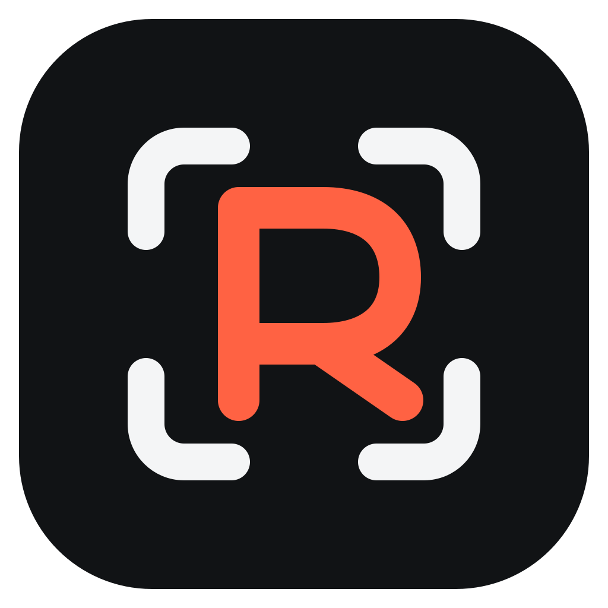

<p align="center">
	
</p>

<h1 align="center">FlowReco</h1>

<p align="center">
	Local-first screen recording, cinematic editing, and optional sharing.
</p>

> [!IMPORTANT]
> FlowReco is under active construction. This repository contains a working Cap-derived
> foundation and early FlowReco-specific hardening, but it is not yet a release-qualified
> macOS or Windows application. Treat every feature not backed by evidence in the
> [test report](docs/TEST_REPORT.md) as unverified or planned.

FlowReco is an open-source recorder and editor for product demos, tutorials, bug reports,
onboarding, engineering walkthroughs, async updates, support, and social content. It
keeps source recordings local and non-destructive by default, makes upload an explicit
choice, and is being built around smooth, editable interaction-driven zooms.

Cap is the primary architecture and media-pipeline foundation. Recordly is a secondary
behavioral reference for editing ideas. FlowReco remains one Tauri/SolidStart desktop app
with a Rust media path and one optional Next.js sharing platform; it does not add an
Electron or PixiJS runtime.

## Project status

The product contract is larger than the code currently qualified. The authoritative
per-feature status is in [FEATURE_MATRIX.md](docs/FEATURE_MATRIX.md), and milestone exit
criteria are in [IMPLEMENTATION_PLAN.md](docs/IMPLEMENTATION_PLAN.md).

### Verified in the current workspace

- Cap, Recordly, and the requested UI-design source were cloned separately and pinned.
- The Cap source snapshot was imported into a clean FlowReco Git repository without either
  upstream Git history.
- Original FlowReco marks, app icons, installer art, cursor assets, sounds, and editor
  backgrounds have been generated and inspected; asset and dependency clearance is
  still a release gate.
- The final scoped desktop Vitest suite completed with 55 passing tests.
- The Chrome extension unit suite completed with 10 passing tests.
- Earlier web and desktop frontend build/type checkpoints passed; final-tree reruns are
  blocked by incomplete workspace dependency links in this runner and remain release gates.
- Scoped Biome checks passed for the desktop and branding files changed so far.

### Implemented but not fully qualified

- Exact keyboard-event capture and desktop telemetry now default off and require a
  fresh explicit opt-in. Their Rust tests cannot run on the current host.
- A deterministic first-stage auto-zoom suggestion generator handles click intent,
  bounded dwell, lead/hold/merge timing, edge-safe focus, reduced motion, avoidance
  zones, and corrupt input. Focused Rust tests exist but have not been executed here.
- Desktop-facing FlowReco identity and local/open feature paths are in progress. Some
  inherited web copy, compatibility identifiers, and server behavior still require
  audit.

### Planned acceptance scope

- Reliable display, window, and region capture with camera, microphone, and system
  audio on macOS 14+ and Windows 10 build 19041+/Windows 11.
- Instant and Studio recording, pause/resume, crash recovery, autosave, and durable
  local fallback when a network or upload fails.
- A non-destructive multitrack editor with editable auto-zooms, cursor and webcam
  effects, trims, speed regions, backgrounds, crop, captions, annotations, and audio.
- Preview/export parity, MP4 through 4K UHD at 60 fps where hardware permits, and GIF
  export.
- Optional dashboard, share pages, access policies, comments, analytics, teams,
  configurable AI providers, S3-compatible storage, and self-hosting.
- Signed and tested macOS and Windows installers, updates, migrations, accessibility,
  performance, privacy, security, and license qualification.

No native capture, save/reopen/export, sharing, or self-hosting workflow should be
described as complete until its repeatable evidence is recorded in
[TEST_REPORT.md](docs/TEST_REPORT.md).

## Product and privacy contract

FlowReco is being developed against these invariants:

- Original source recordings are immutable; edits are project data.
- Local media is made durable before optional upload work can affect it.
- Upload state is visible and no recording is silently uploaded.
- Exact keystrokes, passwords, clipboard contents, and accessibility text are not
  required for interaction-driven zooms. Exact keyboard capture is off by default.
- Telemetry is off by default and requires an explicit FlowReco opt-in.
- AI is optional, provider-configurable, and must not receive media without a clear
  user action.
- Preview and export evaluate the same scene transforms.
- Normal local exports have no forced watermark or paid-plan gate.

These are release requirements, not blanket claims that every enforcement path has
already been qualified. Open privacy and reliability checks remain visible in the
feature matrix and test report.

## Architecture

FlowReco keeps the proven native foundation while evolving the product as one coherent
system:

| Area | Primary location | Stack or responsibility |
| --- | --- | --- |
| Desktop | `apps/desktop` | Tauri v2 host, SolidStart recorder/editor, local settings and projects |
| Capture and media | `crates/*` | Screen, camera, audio, cursor, encoding, muxing, rendering, and export |
| Web | `apps/web` | Next.js dashboard, share pages, authentication, and API routes |
| Domain and data | `packages/web-*`, `packages/database` | Effect services, policy, Drizzle, and MySQL |
| Object storage | `packages/s3` | Hosted or user-supplied S3-compatible storage |
| Media service | `apps/media-server` | Optional hosted media processing |
| SDK and CLI | `packages/sdk-*`, `apps/cli` | Embed, recorder, and administrative surfaces |

Read [ARCHITECTURE.md](docs/ARCHITECTURE.md) for module boundaries, data flow, project
invariants, and the shared preview/export plan.

## Upstream provenance

The research clones live outside this repository. FlowReco is based on the following exact
revisions, inspected on 2026-07-14:

| Source | Pinned revision | Role |
| --- | --- | --- |
| [Cap](https://github.com/CapSoftware/cap/commit/bf6e56d3e8804da33abd21d9470a02cb50adefc0) | `bf6e56d3e8804da33abd21d9470a02cb50adefc0` | Primary architecture and product foundation |
| [Recordly](https://github.com/webadderallorg/Recordly/commit/360b1605009b1c9439629bfaf2033c59f94c611b) | `360b1605009b1c9439629bfaf2033c59f94c611b` | Behavioral research; the direct-port register is currently empty |
| [UI design skill](https://github.com/mblode/agent-skills/commit/d7c7ae79009a2c6f103154b5c476d2b7b75e4fd7) | `d7c7ae79009a2c6f103154b5c476d2b7b75e4fd7` | Frontend design and verification guidance |

See [UPSTREAM_SOURCES.md](docs/UPSTREAM_SOURCES.md),
[UPSTREAM_AUDIT.md](docs/UPSTREAM_AUDIT.md), and
[THIRD_PARTY_NOTICES.md](THIRD_PARTY_NOTICES.md) before porting code, changing assets,
or preparing a distribution.

## Development requirements

- Node.js 20 or newer
- Corepack with pnpm 10.5.2 (the version pinned in `package.json`)
- Rust 1.88.0 (pinned in `rust-toolchain.toml`)
- Platform prerequisites required by Tauri and the native media crates
- Docker for the full web stack, MySQL, MinIO, and self-hosting work
- macOS 14+ or Windows 10 build 19041+/Windows 11 for release-platform capture tests

On Windows, the inherited native setup currently expects LLVM, Clang, and vcpkg. On
macOS, it expects CMake. Native capture permissions apply to the terminal or development
host process that launches the Tauri application.

## Setup

From the repository root in a supported development environment:

```bash
corepack enable
pnpm install
pnpm env-setup
pnpm cap-setup
```

`cap-setup`, `@cap/*`, `cap-*`, and some `CAP_*` environment variables are intentional
compatibility identifiers inherited from the pinned foundation. They are not FlowReco
product branding and must not be renamed mechanically. Migrate them only with an
explicit compatibility plan and tests.

The environment assistant writes local configuration to `.env`. Review generated
values before starting services, never commit secrets, and replace all development
secrets before exposing a deployment.

## Run and build

| Command | Purpose | Requirements |
| --- | --- | --- |
| `pnpm dev:desktop` | Prepare native dependencies and run the Tauri desktop app | Rust, native toolchain, release-platform permissions |
| `pnpm dev:web` | Run workspace web development without the desktop app | Docker-backed services for the normal root workflow |
| `pnpm dev` | Run the full local stack | Docker plus desktop and web prerequisites |
| `pnpm --filter @cap/desktop build` | Build the desktop SolidStart frontend only | Installed Node workspace |
| `pnpm build` | Build workspace packages through Turbo | Full configured workspace |
| `pnpm tauri:build` | Build a native desktop release artifact | Rust, native dependencies, signing setup as applicable |

The current repository does not provide a supported prebuilt FlowReco download. Native
artifacts produced before the release gates pass are development builds.

## Tests and quality checks

Use scoped checks while iterating and the full gates before a release or broad pull
request:

```bash
# Desktop frontend
pnpm --filter @cap/desktop exec vitest run
pnpm exec tsc --noEmit -p apps/desktop/tsconfig.json
pnpm --filter @cap/desktop build

# Formatting and linting (replace paths with the files you changed)
pnpm exec biome check path/to/file.ts path/to/file.tsx

# Desktop Rust
cargo fmt --all -- --check
cargo test -p cap-desktop

# Full workspace
pnpm test
pnpm typecheck
pnpm lint
pnpm build
```

Tests involving capture devices, permissions, GPU paths, audio synchronization,
hardware encoders, crash recovery, installers, or updates must also run on supported
macOS and Windows hosts. A Linux frontend build does not substitute for those checks.

### Current environment blockers

The latest checked workspace is a Linux sandbox with Node.js and FFmpeg but without a
Rust toolchain, Docker, macOS/Windows capture APIs, release credentials, or real capture
permissions. Consequently:

- Rust formatting, compilation, clippy, unit tests, and native Tauri builds are blocked.
- MySQL/MinIO integration and fresh Docker Compose self-hosting checks are blocked.
- Display/window/region, camera, microphone, system-audio, device-loss, low-disk,
  crash-recovery, and release-platform export workflows are unverified.
- Signing, notarization, updater, custom-domain, hosted object-storage, configured AI,
  and analytics checks are unverified.

See [TEST_REPORT.md](docs/TEST_REPORT.md) for exact commands, failures, and reproduction
steps. A blocker is not a pass.

## Documentation

| Document | Purpose |
| --- | --- |
| [FEATURE_MATRIX.md](docs/FEATURE_MATRIX.md) | User-visible capability inventory, provenance, status, and required tests |
| [IMPLEMENTATION_PLAN.md](docs/IMPLEMENTATION_PLAN.md) | Milestones, dependencies, deliverables, and exit gates |
| [ARCHITECTURE.md](docs/ARCHITECTURE.md) | System boundaries, project model, data flows, and invariants |
| [DECISIONS.md](docs/DECISIONS.md) | Architecture and product decision log |
| [TEST_REPORT.md](docs/TEST_REPORT.md) | Verification ledger, blockers, and manual release matrix |
| [UI_DIRECTION.md](docs/UI_DIRECTION.md) | Original FlowReco visual system and frontend interaction rules |
| [UPSTREAM_SOURCES.md](docs/UPSTREAM_SOURCES.md) | Pinned sources and component provenance register |
| [UPSTREAM_AUDIT.md](docs/UPSTREAM_AUDIT.md) | License, asset, dependency, and release-gate audit |
| [THIRD_PARTY_NOTICES.md](THIRD_PARTY_NOTICES.md) | Runtime attribution and unresolved third-party notices |

## Contributing

Read [AGENTS.md](AGENTS.md) before changing code. It contains generated-file rules,
formatting and clippy constraints, scoped verification commands, and guidance for the
remaining internal compatibility names. Keep status claims evidence-based, add tests
for behavior changes, update the feature matrix and decision log when scope changes,
and preserve upstream attribution.

## License

The main work is available under AGPL-3.0 as described in [LICENSE](LICENSE). The
identified `cap-camera*` and `scap-*` crate families use the MIT license in
[licenses/LICENSE-MIT](licenses/LICENSE-MIT); third-party components retain their own
licenses. FlowReco is not release-cleared until the dependency, native artifact, and asset
license gates in the upstream audit are complete.
