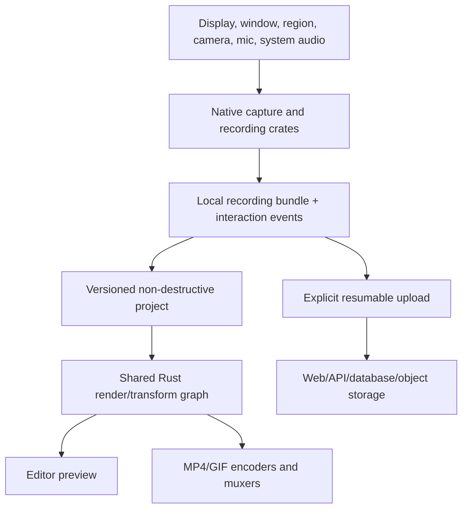
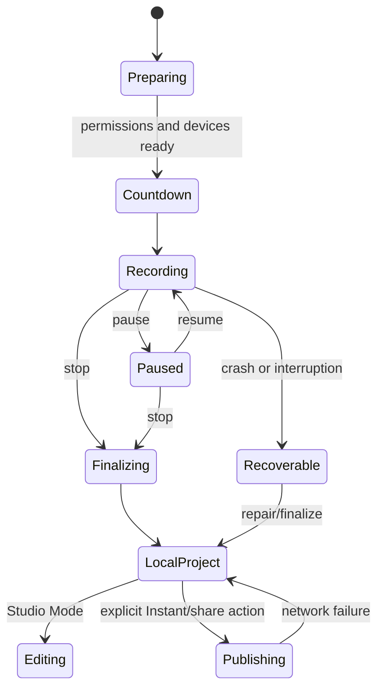
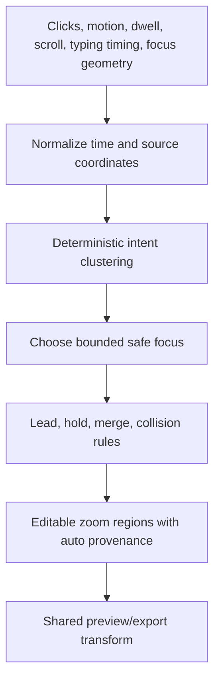
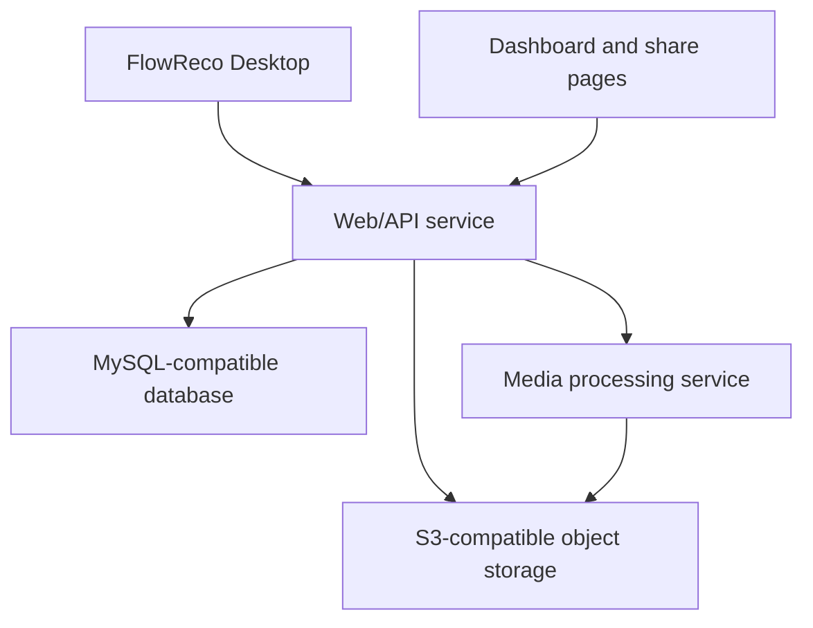

# FlowReco architecture

## Goals

FlowReco keeps Cap's production-oriented Tauri/Rust and web-platform boundaries, then integrates editor behavior as one coherent project and render graph. Original source media is immutable. Project edits are data. Preview and export consume the same transform model.

## Workspace boundaries

| Boundary | Primary paths | Responsibility | Invariant |
| --- | --- | --- | --- |
| Desktop UI | `apps/desktop/src` | Source/device selection, recording state, editor/timeline/inspector, settings, export/share orchestration | UI never owns the authoritative media transform |
| Desktop host | `apps/desktop/src-tauri` | Tauri commands, window/tray lifecycle, permissions, recording sessions, recovery, filesystem, settings, upload coordination | Local recording survives network/UI failure |
| Capture | `crates/scap-*`, `crates/camera*`, `crates/audio`, `crates/cursor-*`, `crates/recording` | Platform capture, timestamps, synchronized source production, safe interaction metadata | No typed content, password, clipboard, or accessibility text in interaction data |
| Project/editor model | `crates/project`, `crates/editor` | Versioned edits, migrations, source references, time mapping | Original sources are immutable and missing media produces a recoverable state |
| Render graph | `crates/rendering*` | Canvas layout, crop, background, zoom, cursor, webcam, captions, annotations | Deterministic at project time and shared by preview/export |
| Media output | `crates/export`, `crates/enc-*`, `crates/cap-muxer*`, `crates/video-decode` | Decode, composition, encode, GIF, audio/video mux, progress/cancel | Timestamp mapping keeps A/V and overlays synchronized |
| Web product | `apps/web`, `packages/web-backend`, `packages/web-domain`, `packages/web-api-contract*` | Auth, dashboard, recordings, sharing, collaboration, analytics, API | Access policy is enforced server-side, not only in UI |
| Persistence | `packages/database`, `packages/s3` | Metadata, migrations, object-store abstraction | Storage provider is configurable and object access is least-privilege |
| Public integrations | `packages/sdk-*`, `apps/cli` | Embed/recorder SDKs and admin/local CLI workflows | Versioned APIs and explicit authentication |

Internal package/crate names inherited from Cap may remain temporarily. Public product strings, identifiers, assets, documentation, endpoints, and release metadata must present FlowReco. Renaming internal symbols is deferred until it can be migration-safe.

## Recording lifecycle

Each session writes media and metadata incrementally into a local bundle. Finalization may repair indexes or mux tracks, but it may not delete recoverable sources. Instant Mode's upload queue is a secondary consumer: resumable chunks and publish state never become the only copy.

## Project model

A project records:

- schema version and migration history;
- immutable source descriptors and checksums/relative references;
- source dimensions, display scale, crop, frame rate, and clocks;
- synchronized screen, webcam, microphone, and system-audio tracks;
- cursor/interaction events containing timing and geometry only;
- clip trims, splits, speed regions, time-map and audio policy;
- zoom regions and their automatic provenance/defaults;
- cursor, webcam, background/frame, caption, annotation, audio, and export settings;
- autosave/recovery state and optional publish metadata.

Project writes are atomic. Autosave uses a temporary file plus replace and never edits source media. Unknown future fields should round-trip where practical; destructive migrations require an explicit backup.

## Time and coordinate systems

Capture events use a monotonic session clock. The project maps source time to edited project time through trims and variable-speed regions. Renderer consumers query the same mapping so video, separate audio, cursor, zooms, captions, webcam, and annotations remain synchronized.

Pointer coordinates are normalized through display origin, DPI/Retina scale, selected target bounds, source-frame dimensions, crop, and output canvas. Stored zoom focus is normalized to content space. Output safe margins and webcam/caption avoidance are render-time constraints, not destructive coordinate rewrites.

## Automatic zoom pipeline

The generator must be deterministic for equal inputs. Sanitized configuration bounds zoom scale and timing. Suggestions become ordinary project regions and can be regenerated, rejected, moved, resized, copied, or reset without losing source events.

## Privacy and network boundaries

- Enhanced input/accessibility capture is explicit permission and stores geometry/role timing, not content.
- Exact keyboard capture is disabled by default; ordinary typing activity is timing only.
- Desktop telemetry is disabled unless a user explicitly opts in after the FlowReco migration marker.
- Upload, AI, transcription provider, analytics, and external integrations are independently visible and configurable.
- Localhost/self-hosted use must not depend on a Cap commercial entitlement check.
- Secrets remain server-side or in the platform keychain/credential store; project files do not embed long-lived credentials.

## Extension boundary

Extension behavior is planned, not enabled. A safe design requires signed/versioned manifests, declared capabilities, isolated execution, explicit filesystem/network/render-hook permissions, resource limits, update/revocation, and deterministic project serialization. FlowReco will not load Recordly/Electron extensions directly.

## Deployment topology

The same topology supports a hosted deployment or self-hosted Docker Compose. Custom domains terminate at the deployment ingress. AI and email providers are optional adapters.

## Observability and failure policy

Use structured logs with recording/project/export IDs but no private event content. Recording health, dropped frames, clock drift, encoder selection, disk pressure, upload retry, and recovery outcomes should be locally diagnosable. Telemetry export is opt-in. Failures surface what is safe, the last successful checkpoint, and the next recovery action.

